<h1> Laporan Quiz 1 Mobile </h1>
<b> Nama : Bagus Dwi Putranto  
 Kelas : TI 3H  
 NIM : 2141720079 </b>

<h3> SOAL </h3>  
No 1    

  

    void main(List<String> arguments) {
    // Tugas 1
    print('Hello World');

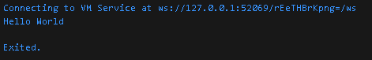

<b>Jawab : Fungsi dari print adalah mencetak sebuah value</b>

 
No 2    

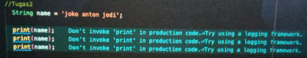    

    void main(List<String> arguments) {
    // // TUgas 1
    // print('Hello World');

    // Tugas 2
    String name = 'Bagus Dwi Putranto';

    print(name);
    print(name);
    print(name);

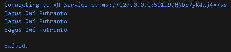

<b>Jawab : Pada kasus diatas fungsi melakukan print memiliki value yaitu variable name</b>

No 3    

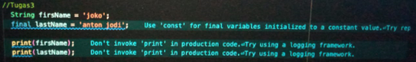   

    void main(List<String> arguments) {
    // // TUgas 1
    // print('Hello World');

    // // Tugas 2
    // String name = 'Bagus Dwi Putranto';

    // print(name);
    // print(name);
    // print(name);

    // Tugas 3
    String firstName = 'Bagus';
    final lastName = 'Dwi Putranto';

    print(firstName);
    print(lastName);

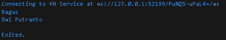

<b>Jawab : Pada kasus diatas ada 2 print, pembacaan code urut dari baris code atas ke baris code berikutnya </b>

No 4.1    

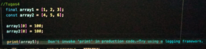   

    void main(List<String> arguments) {
    // // TUgas 1
    // print('Hello World');

    // // Tugas 2
    // String name = 'Bagus Dwi Putranto';

    // print(name);
    // print(name);
    // print(name);

    // // Tugas 3
    // String firstName = 'Bagus';
    // final lastName = 'Dwi Putranto';

    // print(firstName);
    // print(lastName);

    // Tugas 4
    final array1 = [1, 2, 3];
    final array2 = [4, 5, 6];

    array1[0] = 100;
    array2[0] = 100;

    print(array1);

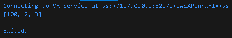

<b>Jawab : Variable array bisa menampung lebih dari 1 data, dengan syarat tipenya harus sesuai dengan variable pada saat awal deklarasi, index dari array dimulai dari 0. Pada kasus diatas var array1 index ke 1 yaitu index 0 dirubah valuenya menjadi 100, begitu juga dengan var array2 </b>

No 4.2    

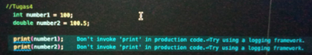

    void main(List<String> arguments) {
    // // TUgas 1
    // print('Hello World');

    // // Tugas 2
    // String name = 'Bagus Dwi Putranto';

    // print(name);
    // print(name);
    // print(name);

    // // Tugas 3
    // String firstName = 'Bagus';
    // final lastName = 'Dwi Putranto';

    // print(firstName);
    // print(lastName);

    // // Tugas 4.1
    // final array1 = [1, 2, 3];
    // final array2 = [4, 5, 6];

    // array1[0] = 100;
    // array2[0] = 100;

    // print(array1);

    // Tugas 4.2
    int number1 = 100;
    double number2 = 100.5;

    print(number1);
    print(number2);

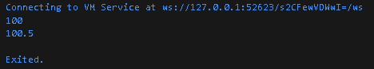

<b>Jawab : Type data untuk nomor pada dart kita bisa menggunakan type int dan double. Beda int dengan double adalah int hanya untuk value angka biasa sedangkan double bisa berisi value angka desimal</b>

No 5    

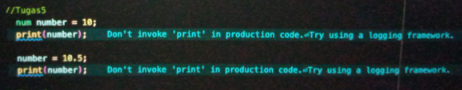    

    void main(List<String> arguments) {
    // // TUgas 1
    // print('Hello World');

    // // Tugas 2
    // String name = 'Bagus Dwi Putranto';

    // print(name);
    // print(name);
    // print(name);

    // // Tugas 3
    // String firstName = 'Bagus';
    // final lastName = 'Dwi Putranto';

    // print(firstName);
    // print(lastName);

    // // Tugas 4
    // final array1 = [1, 2, 3];
    // final array2 = [4, 5, 6];

    // array1[0] = 100;
    // array2[0] = 100;

    // print(array1);

    // TUgas 5
    num number = 10;
    print(number);

    number = 10.5;
    print(number);

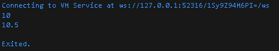

<b>Jawab : Untuk mengubah value dari sebuah variable kita bisa memanggil variable tersebut lalu mengganti dengan variable yang baru, tapi dengan syarat type variabe harus sama dengan type variable yang diganti</b>

No 6    

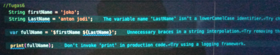    

    void main(List<String> arguments) {
    // // TUgas 1
    // print('Hello World');

    // // Tugas 2
    // String name = 'Bagus Dwi Putranto';

    // print(name);
    // print(name);
    // print(name);

    // // Tugas 3
    // String firstName = 'Bagus';
    // final lastName = 'Dwi Putranto';

    // print(firstName);
    // print(lastName);

    // // Tugas 4
    // final array1 = [1, 2, 3];
    // final array2 = [4, 5, 6];

    // array1[0] = 100;
    // array2[0] = 100;

    // print(array1);

    // // TUgas 5
    // num number = 10;
    // print(number);

    // number = 10.5;
    // print(number);

    // Tugas 6
    String firstName = 'Bagus';
    String LastName = 'Dwi Putranto';

    var fullName = '$firstName ${LastName}';

    print(fullName);

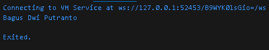

<b>Jawab :  Pada kasus diatas fungsi dari $ adalah untuk memanggil sebuah variable di dalam petik</b>

No 7    

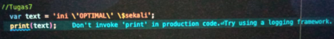    

    void main(List<String> arguments) {
    // // TUgas 1
    // print('Hello World');

    // // Tugas 2
    // String name = 'Bagus Dwi Putranto';

    // print(name);
    // print(name);
    // print(name);

    // // Tugas 3
    // String firstName = 'Bagus';
    // final lastName = 'Dwi Putranto';

    // print(firstName);
    // print(lastName);

    // // Tugas 4.1
    // final array1 = [1, 2, 3];
    // final array2 = [4, 5, 6];

    // array1[0] = 100;
    // array2[0] = 100;

    // print(array1);

    // // Tugas 4.2
    // int number1 = 100;
    // double number2 = 100.5;

    // print(number1);
    // print(number2);

    // // Tugas 5
    // num number = 10;
    // print(number);

    // number = 10.5;
    // print(number);

    // // Tugas 6
    // String firstName = 'Bagus';
    // String LastName = 'Dwi Putranto';

    // var fullName = '$firstName ${LastName}';

    // print(fullName);

    // Tuags 7
    var text = 'ini \'OPTIMAL\' \$sekali';
    print(text);

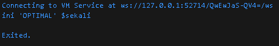

<b>Jawab :  Fungsi back slash pada code diatas adalah untuk membatasi karakter, pada kasus diatas memiliki 3 karakter yaitu ,ini 'OPTIMAL', dan $sekali</b>

No 8    

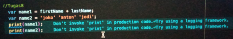    

    void main(List<String> arguments) {
    // // TUgas 1
    // print('Hello World');

    // // Tugas 2
    // String name = 'Bagus Dwi Putranto';

    // print(name);
    // print(name);
    // print(name);

    // // Tugas 3
    // String firstName = 'Bagus';
    // final lastName = 'Dwi Putranto';

    // print(firstName);
    // print(lastName);

    // // Tugas 4.1
    // final array1 = [1, 2, 3];
    // final array2 = [4, 5, 6];

    // array1[0] = 100;
    // array2[0] = 100;

    // print(array1);

    // // Tugas 4.2
    // int number1 = 100;
    // double number2 = 100.5;

    // print(number1);
    // print(number2);

    // // Tugas 5
    // num number = 10;
    // print(number);

    // number = 10.5;
    // print(number);

    // // Tugas 6
    String firstName = 'Bagus';
    String LastName = 'Dwi Putranto';

    // var fullName = '$firstName ${LastName}';

    // print(fullName);

    // // Tuags 7
    // var text = 'ini \'OPTIMAL\' \$sekali';
    // print(text);

    // TUgas 8
    var name1 = firstName + LastName;
    var name2 = 'Bagus' 'Dwi' 'Putranto';
    print(name1);
    print(name2);

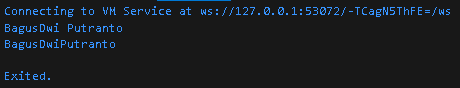

<b>Jawab : Untuk memanggil 2 variable sekaligus kita bisa menggunakan + setelah penyebutan variable pertama </b>

No 9    

    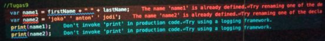    

        void main(List<String> arguments) {
        // // TUgas 1
        // print('Hello World');

        // // Tugas 2
        // String name = 'Bagus Dwi Putranto';

        // print(name);
        // print(name);
        // print(name);

        // // Tugas 3
        // String firstName = 'Bagus';
        // final lastName = 'Dwi Putranto';

        // print(firstName);
        // print(lastName);

        // // Tugas 4.1
        // final array1 = [1, 2, 3];
        // final array2 = [4, 5, 6];

        // array1[0] = 100;
        // array2[0] = 100;

        // print(array1);

        // // Tugas 4.2
        // int number1 = 100;
        // double number2 = 100.5;

        // print(number1);
        // print(number2);

        // // Tugas 5
        // num number = 10;
        // print(number);

        // number = 10.5;
        // print(number);

        // // Tugas 6
        String firstName = 'Bagus';
        String LastName = 'Dwi Putranto';

        // var fullName = '$firstName ${LastName}';

        // print(fullName);

        // // Tuags 7
        // var text = 'ini \'OPTIMAL\' \$sekali';
        // print(text);

        // // Tugas 8
        // var name1 = firstName + LastName;
        // var name2 = 'Bagus' 'Dwi' 'Putranto';
        // print(name1);
        // print(name2);

        // Tugas 9
        var name1 = firstName + " " + LastName;
        var name2 = 'Bagus' 'Dwi' 'Putranto';
        print(name1);
        print(name2);

    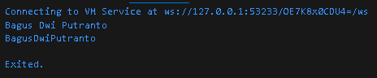

    <b>Jawab : Sama seperti no 8, bedanya pada tugas 9 var pemanggilannya ada memanggil spasi </b>

    No 10    

    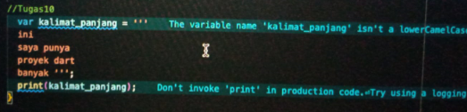    

    void main(List<String> arguments) {
    // // TUgas 1
    // print('Hello World');

    // // Tugas 2
    // String name = 'Bagus Dwi Putranto';

    // print(name);
    // print(name);
    // print(name);

    // // Tugas 3
    // String firstName = 'Bagus';
    // final lastName = 'Dwi Putranto';

    // print(firstName);
    // print(lastName);

    // // Tugas 4.1
    // final array1 = [1, 2, 3];
    // final array2 = [4, 5, 6];

    // array1[0] = 100;
    // array2[0] = 100;

    // print(array1);

    // // Tugas 4.2
    // int number1 = 100;
    // double number2 = 100.5;

    // print(number1);
    // print(number2);

    // // Tugas 5
    // num number = 10;
    // print(number);

    // number = 10.5;
    // print(number);

    // // Tugas 6
    // String firstName = 'Bagus';
    // String LastName = 'Dwi Putranto';

    // var fullName = '$firstName ${LastName}';

    // print(fullName);

    // // Tuags 7
    // var text = 'ini \'OPTIMAL\' \$sekali';
    // print(text);

    // // Tugas 8
    // var name1 = firstName + LastName;
    // var name2 = 'Bagus' 'Dwi' 'Putranto';
    // print(name1);
    // print(name2);

    // // Tugas 9
    // var name1 = firstName + " " + LastName;
    // var name2 = 'Bagus' 'Dwi' 'Putranto';
    // print(name1);
    // print(name2);

    // Tugas 10
    var kalimat_panjang = '''ini
    saya punya
    proyek dart
    banyak ''';
    print(kalimat_panjang);
    }

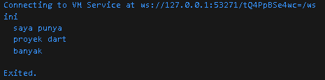

<b>Jawab : Untuk menuliskan text dengan line yang banyak kita harus menggunakan petik 3</b>